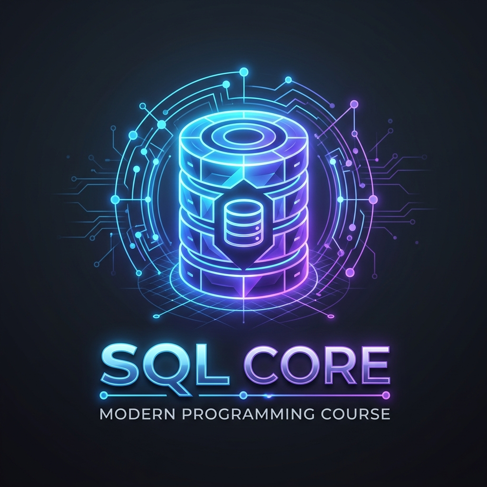

<div align="center">
  
  <h1>🛢️ SQL Lessons (Ελληνική Έκδοση)</h1>
  <p><strong>Ένα πλήρες, δομημένο και διαδραστικό εκπαιδευτικό πρόγραμμα για την εκμάθηση της γλώσσας SQL!</strong></p>

  <!-- Badges -->
  <a href="https://jupyter.org/">
    
  </a>
  <a href="https://www.sqlite.org/index.html">
    
  </a>
  <a href="https://colab.research.google.com/">
    
  </a>
  <br>
  
  
</div>

---

## 🌟 Σχετικά με το μάθημα

Καλώς ήρθατε στο αποθετήριο μαθημάτων **SQL**! Αυτό το αποθετήριο περιέχει ένα αναλυτικό εκπαιδευτικό πρόγραμμα (curriculum) ιδανικό για αρχάριους, αλλά και για όσους θέλουν να φρεσκάρουν τις γνώσεις τους στη διαχείριση και ανάλυση δεδομένων.

Όλα τα μαθήματα είναι γραμμένα στα **Ελληνικά** και παρέχονται σε μορφή **Jupyter Notebooks**, ώστε να διαβάζετε τη θεωρία και να εκτελείτε τον κώδικα SQL άμεσα, χωρίς να χρειάζεται να εγκαταστήσετε κάποιον βαρύ Database Server (χρησιμοποιούμε τη βιβλιοθήκη `sqlite3` της Python).

> 💡 **Πρακτική Εξάσκηση:** Κάθε ενότητα περιλαμβάνει ξεχωριστά αρχεία με **Ασκήσεις** (`Exercises.ipynb`) και τις αναλυτικές **Λύσεις** τους (`Solutions.ipynb`), γιατί η θεωρία χρειάζεται και πράξη!

---

## 🤔 Τι είναι η SQL και πού χρησιμοποιείται;

Η **SQL** (Structured Query Language) είναι η πιο δημοφιλής γλώσσα προγραμματισμού για τη διαχείριση και επεξεργασία δεδομένων σε **Σχεσιακές Βάσεις Δεδομένων** (Relational Databases). 

**Γιατί να μάθετε SQL;**
- **Βρίσκεται παντού:** Από μικρές εφαρμογές κινητών (SQLite) μέχρι τεράστια εταιρικά συστήματα (PostgreSQL, MySQL, SQL Server, Oracle).
- **Ανάλυση Δεδομένων (Data Analysis):** Είναι το βασικότερο εργαλείο (μαζί με την Python/R) για Data Analysts και Data Scientists προκειμένου να εξάγουν insights από raw data.
- **Back-end Development:** Κάθε web ή mobile εφαρμογή (π.χ. e-shops, social media) χρησιμοποιεί SQL στο παρασκήνιο για να αποθηκεύει χρήστες, παραγγελίες και μηνύματα.
- **Είναι φιλική:** Η σύνταξή της μοιάζει πολύ με απλά Αγγλικά (π.χ. `SELECT name FROM users WHERE age > 18;`).

---

## 📚 Δομή Μαθημάτων (Curriculum)

Η ύλη είναι χωρισμένη σε 10 λογικά βήματα, ξεκινώντας από τα απολύτως βασικά και καταλήγοντας σε πιο σύνθετες τεχνικές και projects:

| Ενότητα | Περιεχόμενο |
| :--- | :--- |
| **[01_SQL_Basics](01_SQL_Basics/)** | Εισαγωγή, Σχεσιακά Μοντέλα, `SELECT`, `FROM`, `WHERE`, `ORDER BY`. |
| **[02_Data_Manipulation](02_Data_Manipulation/)** | Χειρισμός Δεδομένων (DML) - `INSERT`, `UPDATE`, `DELETE`. |
| **[03_Data_Definition](03_Data_Definition/)** | Ορισμός Δεδομένων (DDL) - `CREATE`, `ALTER`, `DROP` (Πίνακες & Στήλες). |
| **[04_Functions_and_Aggregation](04_Functions_and_Aggregation/)** | Συναρτήσεις (`SUM`, `AVG`, `COUNT`), Ομαδοποίηση (`GROUP BY`, `HAVING`). |
| **[05_Joins_and_Relations](05_Joins_and_Relations/)** | Συνενώσεις Πινάκων - `INNER JOIN`, `LEFT JOIN`, `RIGHT JOIN`. |
| **[06_Advanced_Querying](06_Advanced_Querying/)** | Προχωρημένα Ερωτήματα - Υποερωτήματα (Subqueries), CTEs, `CASE WHEN`. |
| **[07_Window_Functions](07_Window_Functions/)** | Αναλυτικές Συναρτήσεις - `OVER()`, `PARTITION BY`, `RANK()`, `ROW_NUMBER()`. |
| **[08_Database_Objects](08_Database_Objects/)** | Αντικείμενα Βάσης - Δημιουργία Όψεων (Views) και Ευρετηρίων (Indexes). |
| **[09_Transactions_and_Security](09_Transactions_and_Security/)** | Δοσοληψίες - `ACID`, `COMMIT`, `ROLLBACK`. |
| **[10_Projects](10_Projects/)** | 🚀 **Ολοκληρωμένο Mini-Project**: Σχεδιασμός E-Commerce Συστήματος (Πίνακες, Δεδομένα, Ερωτήματα). |

---

## 🚀 Πώς να ξεκινήσετε

Υπάρχουν δύο τρόποι για να παρακολουθήσετε και να τρέξετε τα μαθήματα:

### 1️⃣ Τοπικά στον Υπολογιστή σας (Προτείνεται)
1. Κατεβάστε το αποθετήριο:
   ```bash
   git clone https://github.com/karidasd/SQL-Lessons.git
   ```
2. Βεβαιωθείτε ότι έχετε εγκατεστημένη την Python. Σας προτείνουμε το **VS Code** ή το **Jupyter Lab**.
3. Εγκαταστήστε τις απαραίτητες βιβλιοθήκες:
   ```bash
   pip install jupyter pandas
   ```
4. Ανοίξτε το τερματικό στο φάκελο του project και τρέξτε:
   ```bash
   jupyter notebook
   ```

### 2️⃣ Μέσω Google Colab (Για να ξεκινήσετε άμεσα!)
Χωρίς εγκαταστάσεις, κατευθείαν στον browser σας!
1. Μεταβείτε στο [Google Colab](https://colab.research.google.com/).
2. Επιλέξτε την καρτέλα **GitHub** και επικολλήστε το link αυτού του repository: `https://github.com/karidasd/SQL-Lessons`.
3. Ανοίξτε οποιοδήποτε μάθημα και ξεκινήστε το γράψιμο κώδικα!

---

<div align="center">
  <i>Αν βρήκατε το περιεχόμενο χρήσιμο, αφήστε ένα ⭐ στο repository!</i>
  <br><br>
  <b>Happy Coding! 💻</b>
</div>
